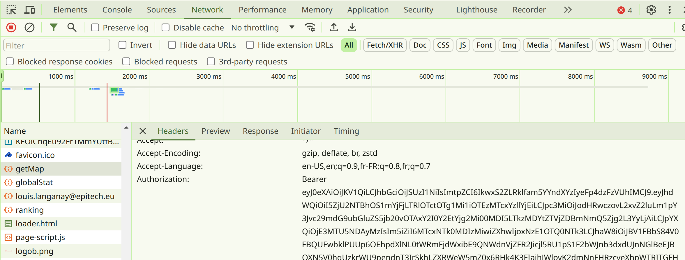
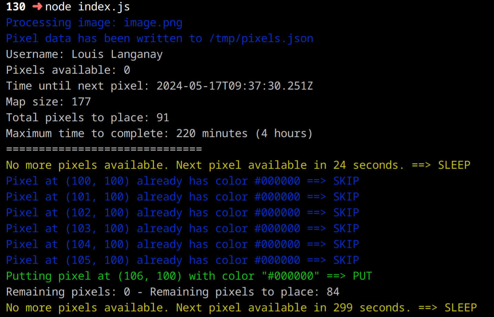

# Tekplace Pixel Bot

## Overview

This is a bot designed to automatically place pixels on the website [Tekplace](https://www.tekplace.eu/) as part of the project by [Alexis Boitel](https://github.com/DiaboloAB).

The bot utilizes an image to convert it into pixels. The bot converts the image colors into the closest Tekplace colors and places the pixels on the website.

> [!WARNING]
> Each pixel placement takes approximately 5 minutes, and the larger the image, the longer it takes.
> For example, a 10x10 image will take around 8 hours to complete.

## Requirements

- Node.js v22.0.0
- npm v10.8.0

## Installation

To use this project, follow these steps:

1. Clone the repository:
   ```sh
   git clone https://github.com/your-username/tekplace-pixel-bot.git
   ```

2. Install dependencies:
   ```sh
   npm install
   ```

3. Rename the `.env.example` file to `.env` and fill in the required information.

    - The token must be obtained from the Tekplace cookies:
        1. Press `CTRL + SHIFT + I` to open Developer Tools.
        2. Go to the Network tab.
        3. Find the getMap request.
        4. Copy the value of the `Authorization` header.
        5. Paste the value into the `.env` file without the `Bearer ` prefix.

    

    - The image path must be a valid path to the image you want to use.
    - The pixels offset is the offset from the top left corner of the image to the top left corner of the pixels on Tekplace.
    - The username is the username of the account you want to use. For example, `louis.langanay@epitech.eu`

4. Run the bot:
   ```sh
   node index.js
   ```

## Usage

Once the bot is running and configured, it will automatically begin placing pixels on Tekplace. Monitor the process and adjust settings as necessary.



## Disclaimer

> [!IMPORTANT]
> Use it responsibly and respect the terms of service of Tekplace. The developers are not responsible for any misuse of this bot.
